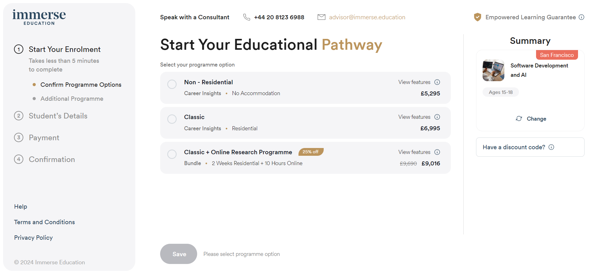

# Immerse Enrolment Module: sample Nest.js project

## Description

Web application for purchasing courses. Our task was to build a complex, multi-step form.

#### Features
  - memorization of all the information entered by the user so that when the user returns, he gets to the step where he left off with all the information already in place
  - synchronization with Salesforce
  - integration with Zapier
  - a complex payment system, which includes the choice of a provider (Stripe or Flywire) depending on the type of product, as well as the implementation of split payments in Stripe

## Technology Stack

 - Nest.js - enterprise-level Node.js framework
 - Prisma - Next-generation Node.js and TypeScript ORM
 - Stripe, Flywire - payment services
 - Zapier - Workflow automation software
